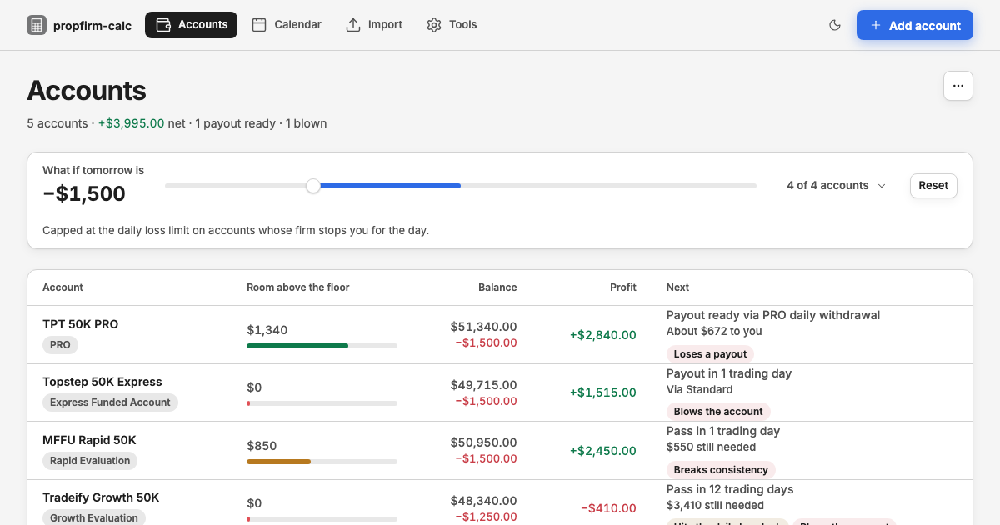

# propfirm-calc

[](https://github.com/shootingallday/propfirm-calc/actions/workflows/ci.yml)
[](https://github.com/shootingallday/propfirm-calc/blob/main/LICENSE)

All your prop firm futures accounts in one place, across firms. Pick your accounts from the firm
list, type or import your daily P&L, and see each account's drawdown floor, consistency,
and next payout. Then drag one slider to see what tomorrow does to every account at once.

There's no sign-up and no broker login. Your data stays in your browser.

**Try it:** https://propfirm-calc.jomardippiton2005.workers.dev opens with five demo accounts
already loaded, so you can drag the slider and open each one before adding your own.



- **What-if slider**: set tomorrow's P&L once and see which account blows, which breaks
  consistency, and which unlocks a payout.
- **Payout calendar**: when each account can pay out at your average winning day, and how much
  lands each week.
- **Firm rules catalog**: Topstep, Tradeify, Lucid Trading, My Funded Futures and Take Profit
  Trader, with every stage and size. Each rule has a source link and the date it was checked. You
  can override any rule on your own account.
- **CSV import**: Tradovate (Fills, Performance, Account Balance History, Cash History) and
  TopstepX (Orders, Trades). Fills are paired into trades, and fees the file leaves out come from
  your per-contract fee.

## Repo layout

| Path | What it is |
| --- | --- |
| `packages/core` | The `propfirm-calc` npm package: rules engine, firm catalog, CSV import, CLI |
| `packages/core/catalog` | One JSON file per firm |
| `packages/core/samples` | Synthetic sample exports for every supported CSV layout |
| `apps/web` | The web app (Vite + React), installable as a PWA |
| `apps/web/src/kit` | The design kit the app is styled with (see `docs/DESIGN.md`) |

## Run it

```bash
pnpm install
pnpm dev          # web app on http://localhost:5173
pnpm test         # engine, catalog and import tests
pnpm e2e          # builds the app, drives it in a real browser, saves screenshots
```

## The engine

```ts
import { createAccount, evaluate, findPlan, FIRMS, importCsv, applyImport, payoutCalendar } from 'propfirm-calc';

const firm = FIRMS.find((f) => f.id === 'topstep')!;
const plan = firm.plans[0]!;
let account = createAccount({ id: '1', label: 'Topstep 50K', firm, plan, stage: 'eval', catalogVersion: '2026-09-03' });

const csv = importCsv(fileText);
account = applyImport(account, csv.accounts[0]!, csv.layout).account;

const now = evaluate(account);
const tomorrow = evaluate(account, { whatIf: -800 });
now.floor; now.cushion; now.consistency; now.evaluation?.daysToPass;
tomorrow.blown;
```

Money is `decimal.js` throughout, so nothing drifts by a cent.

## CLI

```bash
npx propfirm-calc drawdown --balance 50000 --max-dd 2000 --peak 51000 --equity 50500
npx propfirm-calc consistency --best-day 1500 --total 3000 --pct 50
npx propfirm-calc payout --profit 4000 --best-day 3000 --pct 50
npx propfirm-calc size --tick-value 5 --stop-ticks 20 --risk 500
npx propfirm-calc project --profit 2000 --avg-daily 500 --target 3000 --best-day 3000 --pct 50
npx propfirm-calc firms
npx propfirm-calc import Fills.csv
npx propfirm-calc status propfirm-calc-accounts.json --what-if -800
```

Every command takes `--json`.

## Firm rules

Rules come from each firm's own pages, never from review sites. Firms change them every few
months, so every stage records its source and the day it was checked, and the app shows both. If
a rule is wrong, open a
["Wrong firm rule" issue](https://github.com/shootingallday/propfirm-calc/issues/new?template=wrong-firm-rule.yml)
with a link to the firm's page.

## Deploy

It's a static site served from Cloudflare Workers. Sign in once with `npx cf auth login`, then:

```bash
cd apps/web
npx cf deploy
```

`cloudflare.config.ts` names the Worker. `npx cf deploy --dry-run` builds and checks without
uploading.

## License

MIT
